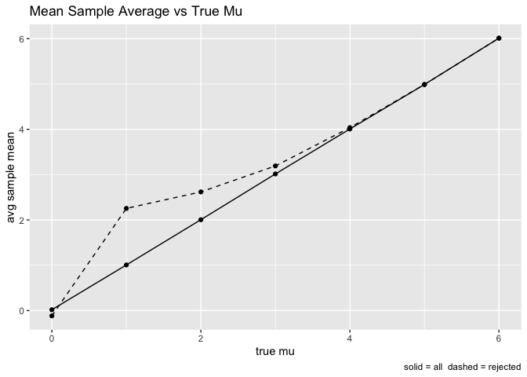

Homework 5
================
Yishi Wang

``` r
library(tidyverse)
```

    ## ── Attaching core tidyverse packages ──────────────────────── tidyverse 2.0.0 ──
    ## ✔ dplyr     1.1.4     ✔ readr     2.1.5
    ## ✔ forcats   1.0.0     ✔ stringr   1.5.2
    ## ✔ ggplot2   4.0.0     ✔ tibble    3.3.0
    ## ✔ lubridate 1.9.4     ✔ tidyr     1.3.1
    ## ✔ purrr     1.1.0     
    ## ── Conflicts ────────────────────────────────────────── tidyverse_conflicts() ──
    ## ✖ dplyr::filter() masks stats::filter()
    ## ✖ dplyr::lag()    masks stats::lag()
    ## ℹ Use the conflicted package (<http://conflicted.r-lib.org/>) to force all conflicts to become errors

``` r
library(ggplot2)


knitr::opts_chunk$set(echo = TRUE, message = FALSE, warning = FALSE)
```

## Problem 1

Build a function that draw n birthdays and return true if there are
duplicates. We use set.seed() for reproducibility:

``` r
set.seed(100)

has_duplicate_bday = function(n) {
  bdays = sample(1:365, n, replace = TRUE)
  return(any(duplicated(bdays)))
}
```

Run simulations and save results as data frame:

``` r
group_sizes = 2:50
bd_simulation = sapply(group_sizes, function(n) mean(replicate(10000, has_duplicate_bday(n))))
bd_simulation_df = data.frame(n = group_sizes, prob = bd_simulation)
```

Plot our simulation result:

``` r
bd_simulation_df |>
  ggplot(aes(x = n, y = prob)) +
  geom_line() +
  geom_point() +
  labs(
    x = "group size",
    y = "P(at least one shared birthday)",
    title = "Probability that duplicated birthday exist in n people"
  ) +
  theme_minimal()
```

<!-- -->

## Problem 2

Build a function that simulates power in one-sample t-test:

``` r
n = 30
sigma = 5
mus = 0:6

explore_test_power = function(mu) {
  replicate(5000, {
    x = rnorm(n, mean = mu, sd = sigma)
    tt = t.test(x, mu = 0)
    broom::tidy(tt)[c("estimate", "p.value")]
  }, simplify = FALSE) |>
    bind_rows(.id = "rep") |>
    mutate(rep = as.integer(rep))
}
```

Run simulations and save results as a data frame:

``` r
set.seed(100)
sim_results <- lapply(mus, explore_test_power) |>
  setNames(as.character(mus))

summary_df <- bind_rows(
  lapply(names(sim_results), function(mu) {
    dat <- sim_results[[mu]]
    dat$mu_true <- as.numeric(mu)
    dat
  })) |>
  group_by(mu_true) |>
  summarise(
    power = mean(p.value < 0.05),
    mean_est_all = mean(estimate),
    mean_est_rejected = if (sum(p.value < 0.05) > 0) mean(estimate[p.value < 0.05]) else NA_real_,
    n_rejected = sum(p.value < 0.05),
    .groups = "drop"
  )
```

Make a plot showing the proportion of times the null was rejected:

``` r
ggplot(summary_df, aes(x = mu_true, y = power)) +
  geom_line() + geom_point() +
  labs(x = "true mu", 
       y = "power",
       title = "Power vs True Mu")
```

<!-- -->

From the plot above, we see the power increases as the true value of
$\mu$ increases, because large effect sizes are easily detected by
t-test. Now we make a plot to show the average estimate of all and
rejected $\hat\mu$:

``` r
ggplot(summary_df, aes(x = mu_true)) +
  geom_line(aes(y = mean_est_all), linetype = "solid") +
  geom_point(aes(y = mean_est_all)) +
  geom_line(aes(y = mean_est_rejected), linetype = "dashed") +
  geom_point(aes(y = mean_est_rejected)) +
  labs(x = "true mu", y = "avg sample mean",
       caption = "solid = all  dashed = rejected",
       title = "Mean Sample Average vs True Mu")
```

<!-- -->

From the plot above, we see the difference between $\hat\mu$ for which
the null is rejected differs and true $\mu$ gets smaller as true $\mu$
gets bigger. Selecting tests with rejected null keeps only the large
sample means, but when almost every sample gets rejected (power
approaches 1), the selection bias disappears.

## Problem 3
