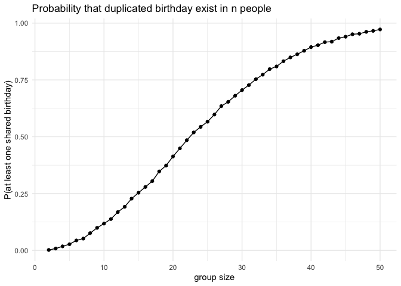
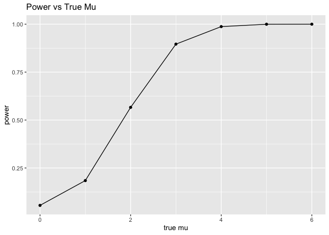
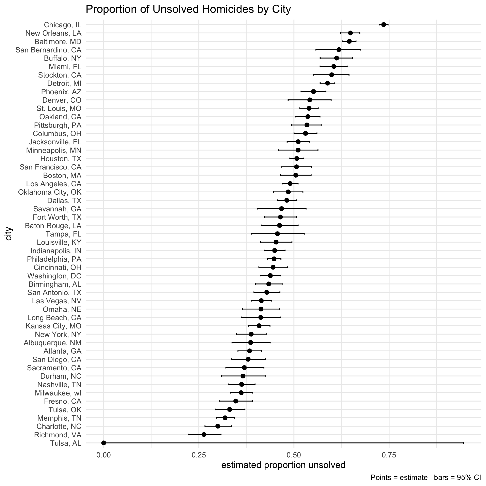

Homework 5
================
Yishi Wang

## Problem 1

Build a function that draw n birthdays and return true if there are
duplicates. We use set.seed() for reproducibility:

``` r
set.seed(100)

has_duplicate_bday = function(n) {
  bdays = sample(1:365, n, replace = TRUE)
  return(any(duplicated(bdays)))
}
```

Run simulations and save results as data frame:

``` r
group_sizes = 2:50
bd_simulation = sapply(group_sizes, function(n) mean(replicate(10000, has_duplicate_bday(n))))
bd_simulation_df = data.frame(n = group_sizes, prob = bd_simulation)
```

Plot our simulation result:

``` r
bd_simulation_df |>
  ggplot(aes(x = n, y = prob)) +
  geom_line() +
  geom_point() +
  labs(
    x = "group size",
    y = "P(at least one shared birthday)",
    title = "Probability that duplicated birthday exist in n people"
  ) +
  theme_minimal()
```

<!-- -->

## Problem 2

Build a function that simulates power in one-sample t-test:

``` r
n = 30
sigma = 5
mus = 0:6

explore_test_power = function(mu) {
  replicate(5000, {
    x = rnorm(n, mean = mu, sd = sigma)
    tt = t.test(x, mu = 0)
    broom::tidy(tt)[c("estimate", "p.value")]
  }, simplify = FALSE) |>
    bind_rows(.id = "rep") |>
    mutate(rep = as.integer(rep))
}
```

Run simulations and save results as a data frame:

``` r
set.seed(100)
sim_results <- lapply(mus, explore_test_power) |>
  setNames(as.character(mus))

summary_df <- bind_rows(
  lapply(names(sim_results), function(mu) {
    dat <- sim_results[[mu]]
    dat$mu_true <- as.numeric(mu)
    dat
  })) |>
  group_by(mu_true) |>
  summarise(
    power = mean(p.value < 0.05),
    mean_est_all = mean(estimate),
    mean_est_rejected = if (sum(p.value < 0.05) > 0) mean(estimate[p.value < 0.05]) else NA_real_,
    n_rejected = sum(p.value < 0.05),
    .groups = "drop"
  )
```

Make a plot showing the proportion of times the null was rejected:

``` r
ggplot(summary_df, aes(x = mu_true, y = power)) +
  geom_line() + geom_point() +
  labs(x = "true mu", 
       y = "power",
       title = "Power vs True Mu")
```

<!-- -->

From the plot above, we see the power increases as the true value of
$\mu$ increases, because large effect sizes are easily detected by
t-test. Now we make a plot to show the average estimate of all and
rejected $\hat\mu$:

``` r
ggplot(summary_df, aes(x = mu_true)) +
  geom_line(aes(y = mean_est_all), linetype = "solid") +
  geom_point(aes(y = mean_est_all)) +
  geom_line(aes(y = mean_est_rejected), linetype = "dashed") +
  geom_point(aes(y = mean_est_rejected)) +
  labs(x = "true mu", y = "avg sample mean",
       caption = "solid = all  dashed = rejected",
       title = "Mean Sample Average vs True Mu")
```

<!-- -->

From the plot above, we see the difference between $\hat\mu$ for which
the null is rejected differs and true $\mu$ gets smaller as true $\mu$
gets bigger. Selecting tests with rejected null keeps only the large
sample means, but when almost every sample gets rejected (power
approaches 1), the selection bias disappears.

## Problem 3

Import and check the data:

``` r
homicides_df = read_csv("local_files/homicide-data.csv") |>
  janitor::clean_names()
```

This dataset is gathered by Washington Post and has data on homicides in
50 large U.S. cities, main variable names include:

**uid** — unique record id.

**reported_date** — date the homicide was reported (YYYYMMDD).

**victim_last, victim_first** — victim name parts.

**victim_race** — victim race/ethnicity.

**victim_age** — victim age.

**victim_sex** — sex/gender.

**city, state** — city and 2-letter state.

**lat, lon** — latitude/longitude.

**disposition** — case disposition.

Next, we create city_state variable and summarize cities to get total
number of homicides and the number of unsolved homicides:

``` r
homicides_df = homicides_df |>
  mutate(city_state = paste0(city, ", ", state))

city_counts = homicides_df |>
  group_by(city_state) |>
  summarise(
    total_homicides = n(),
    unsolved_homicides = sum(disposition %in% c("Closed without arrest", "Open/No arrest"), na.rm = TRUE),
    .groups = "drop"
  )
```

First, filter out the city of Baltimore and use prop.test to estimate
the proportion of unsolved homicides:

``` r
baltimore_counts = city_counts |>
  filter(city_state == "Baltimore, MD")

baltimore_prop_test = prop.test(
  x = baltimore_counts$unsolved_homicides[1],
  n = baltimore_counts$total_homicides[1]
)
```

Save the result from our test above:

``` r
saveRDS(baltimore_prop_test, file = "local_files/baltimore_props.rds", compress = "xz")
```

Tidy and pull the estimated proportion and confidence intervals:

``` r
baltimore_tidy = broom::tidy(baltimore_prop_test)

# The estimated proportion is:
baltimore_tidy$estimate
```

    ##         p 
    ## 0.6455607

``` r
# The lower CI is:
baltimore_tidy$conf.low
```

    ## [1] 0.6275625

``` r
# The upper CI is:
baltimore_tidy$conf.high
```

    ## [1] 0.6631599

Now we run prop.test for all cities similar to what we did on Baltimore,
and return a tidy data frame with purrr package and unnest()

``` r
city_props = city_counts |>
  filter(total_homicides > 0) |>
  mutate(
    prop_test_obj = purrr::map2(unsolved_homicides, total_homicides, ~ prop.test(.x, .y)),
    tidy_test = purrr::map(prop_test_obj, broom::tidy)
  ) |>
  unnest(tidy_test) |>
  select(
    city_state,
    estimate,
    conf.low,
    conf.high,
  )

city_props |> 
  knitr::kable()
```

| city_state         |  estimate |  conf.low | conf.high |
|:-------------------|----------:|----------:|----------:|
| Albuquerque, NM    | 0.3862434 | 0.3372604 | 0.4375766 |
| Atlanta, GA        | 0.3833505 | 0.3528119 | 0.4148219 |
| Baltimore, MD      | 0.6455607 | 0.6275625 | 0.6631599 |
| Baton Rouge, LA    | 0.4622642 | 0.4141987 | 0.5110240 |
| Birmingham, AL     | 0.4337500 | 0.3991889 | 0.4689557 |
| Boston, MA         | 0.5048860 | 0.4646219 | 0.5450881 |
| Buffalo, NY        | 0.6122841 | 0.5687990 | 0.6540879 |
| Charlotte, NC      | 0.2998544 | 0.2660820 | 0.3358999 |
| Chicago, IL        | 0.7358627 | 0.7239959 | 0.7473998 |
| Cincinnati, OH     | 0.4452450 | 0.4079606 | 0.4831439 |
| Columbus, OH       | 0.5304428 | 0.5002167 | 0.5604506 |
| Dallas, TX         | 0.4811742 | 0.4561942 | 0.5062475 |
| Denver, CO         | 0.5416667 | 0.4846098 | 0.5976807 |
| Detroit, MI        | 0.5883287 | 0.5687903 | 0.6075953 |
| Durham, NC         | 0.3659420 | 0.3095874 | 0.4260936 |
| Fort Worth, TX     | 0.4644809 | 0.4222542 | 0.5072119 |
| Fresno, CA         | 0.3470226 | 0.3051013 | 0.3913963 |
| Houston, TX        | 0.5074779 | 0.4892447 | 0.5256914 |
| Indianapolis, IN   | 0.4493192 | 0.4223156 | 0.4766207 |
| Jacksonville, FL   | 0.5111301 | 0.4820460 | 0.5401402 |
| Kansas City, MO    | 0.4084034 | 0.3803996 | 0.4370054 |
| Las Vegas, NV      | 0.4141926 | 0.3881284 | 0.4407395 |
| Long Beach, CA     | 0.4126984 | 0.3629026 | 0.4642973 |
| Los Angeles, CA    | 0.4900310 | 0.4692208 | 0.5108754 |
| Louisville, KY     | 0.4531250 | 0.4120609 | 0.4948235 |
| Memphis, TN        | 0.3190225 | 0.2957047 | 0.3432691 |
| Miami, FL          | 0.6048387 | 0.5685783 | 0.6400015 |
| Milwaukee, wI      | 0.3614350 | 0.3333172 | 0.3905194 |
| Minneapolis, MN    | 0.5109290 | 0.4585150 | 0.5631099 |
| Nashville, TN      | 0.3624511 | 0.3285592 | 0.3977401 |
| New Orleans, LA    | 0.6485356 | 0.6231048 | 0.6731615 |
| New York, NY       | 0.3875598 | 0.3494421 | 0.4270755 |
| Oakland, CA        | 0.5364308 | 0.5040588 | 0.5685037 |
| Oklahoma City, OK  | 0.4851190 | 0.4467861 | 0.5236245 |
| Omaha, NE          | 0.4132029 | 0.3653146 | 0.4627477 |
| Philadelphia, PA   | 0.4478103 | 0.4300380 | 0.4657157 |
| Phoenix, AZ        | 0.5514223 | 0.5184825 | 0.5839244 |
| Pittsburgh, PA     | 0.5340729 | 0.4942706 | 0.5734545 |
| Richmond, VA       | 0.2634033 | 0.2228571 | 0.3082658 |
| Sacramento, CA     | 0.3696809 | 0.3211559 | 0.4209131 |
| San Antonio, TX    | 0.4285714 | 0.3947772 | 0.4630331 |
| San Bernardino, CA | 0.6181818 | 0.5576628 | 0.6753422 |
| San Diego, CA      | 0.3796095 | 0.3354259 | 0.4258315 |
| San Francisco, CA  | 0.5067873 | 0.4680516 | 0.5454433 |
| Savannah, GA       | 0.4674797 | 0.4041252 | 0.5318665 |
| St. Louis, MO      | 0.5396541 | 0.5154369 | 0.5636879 |
| Stockton, CA       | 0.5990991 | 0.5517145 | 0.6447418 |
| Tampa, FL          | 0.4567308 | 0.3881009 | 0.5269851 |
| Tulsa, AL          | 0.0000000 | 0.0000000 | 0.9453792 |
| Tulsa, OK          | 0.3310463 | 0.2932349 | 0.3711192 |
| Washington, DC     | 0.4379182 | 0.4112495 | 0.4649455 |

Lastly, plot our results above:

``` r
city_props_plot = city_props |>
  mutate(city_state = fct_reorder(city_state, estimate))

unsolved_prop_plot = ggplot(city_props_plot, aes(x = city_state, y = estimate)) +
  geom_point(size = 2) +
  geom_errorbar(aes(ymin = conf.low, ymax = conf.high), width = 0.2) +
  coord_flip() +
  labs(
    x = "city",
    y = "estimated proportion unsolved",
    title = "Proportion of Unsolved Homicides by City",
    caption = "Points = estimate   bars = 95% CI"
  ) +
  theme_minimal()

print(unsolved_prop_plot)
```

<!-- -->
